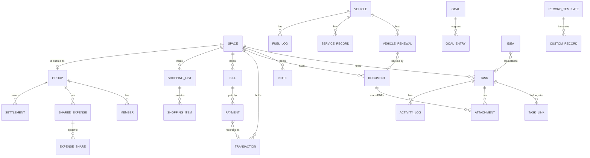

# Kosha — Master Implementation Plan

**Product:** Kosha · Personal Life OS (Flutter, mobile-first)
**Prepared:** 5 September 2026
**Inputs reviewed:** `project-doc/Kosha - Personal Life OS.html` (clickable prototype, 31 screens + 7 sheets/dialogs) and the current Flutter project at the repository root.
**Status of this document:** Living plan. Sections 12 (roadmap) and 17 (open decisions) should be revisited at the end of every phase.

---

## Table of contents

1. [Executive summary](#1-executive-summary)
2. [What was reviewed and what it tells us](#2-what-was-reviewed-and-what-it-tells-us)
3. [Product scope and principles](#3-product-scope-and-principles)
4. [Target architecture](#4-target-architecture)
5. [Domain model](#5-domain-model)
6. [Modules and features](#6-modules-and-features)
7. [UI/UX implementation](#7-uiux-implementation)
8. [Cross-cutting services](#8-cross-cutting-services)
9. [Dependencies](#9-dependencies)
10. [Changes required to the existing project structure](#10-changes-required-to-the-existing-project-structure)
11. [Data flow reference](#11-data-flow-reference)
12. [Development phases and roadmap](#12-development-phases-and-roadmap)
13. [Gaps in the prototype and proposed resolutions](#13-gaps-in-the-prototype-and-proposed-resolutions)
14. [Risks and technical issues](#14-risks-and-technical-issues)
15. [Testing and quality strategy](#15-testing-and-quality-strategy)
16. [CI/CD, environments and release](#16-cicd-environments-and-release)
17. [Open decisions that need an owner](#17-open-decisions-that-need-an-owner)
18. [Appendix A — Screen-by-screen specification](#appendix-a--screen-by-screen-specification)
19. [Appendix B — Prototype seed data (for fixtures and demos)](#appendix-b--prototype-seed-data-for-fixtures-and-demos)
20. [Appendix C — Glossary](#appendix-c--glossary)

---

## 1. Executive summary

Kosha is a single app that replaces "nine apps" for managing a personal life: tasks and reminders, bills and subscriptions, spending, documents with expiry tracking, vehicle and home records, shopping lists, notes, ideas, goals, custom record types, and shared-expense groups (trips). The prototype is complete enough to define the product: 31 screens across 7 areas, 12 wired end-to-end flows, a full light/dark design system, and explicit empty, loading and error states.

The Flutter project is a bare `flutter create` template (counter demo, no packages, no git). Nothing in it is reusable except the platform scaffolding, so the plan treats it as a greenfield build on the existing shell.

**Headline decisions in this plan**

| Area | Decision | Why |
|---|---|---|
| Architecture | Feature-first, three layers (presentation / domain / data), offline-first | 20+ features that share a handful of entities; everything must work with no network |
| State | Riverpod 3 with code generation | Reactive streams from the database straight into widgets, testable, no boilerplate |
| Persistence | Drift (SQLite) with FTS5 for search | Relational model (everything "belongs to" a space), strong typing, reactive queries, encryption path via SQLCipher |
| Navigation | go_router with a stateful shell for the 5 tabs | Deep links, tab-state preservation, matches the prototype's "tab owns sub-screen" model |
| Reminders | flutter_local_notifications + timezone + rrule | Tasks, bills, documents, subscriptions, vehicle renewals all reduce to "schedule a local notification from a recurrence rule" |
| Sharing / sync | Deferred to Phase 5; Supabase recommended | Only the Travel-group feature needs a backend; everything else is local-first |
| Design | Token-driven `ThemeExtension`, Plus Jakarta Sans, Material Symbols Rounded | Direct port of the prototype's CSS variables |

**Roadmap at a glance:** 7 phases, roughly 18–22 working weeks for one full-time developer plus a part-time second developer from Phase 2. A usable personal (non-shared) app exists at the end of Phase 4 (about week 13). See section 12.

---

## 2. What was reviewed and what it tells us

### 2.1 The prototype

The HTML file is a Claude Design bundle. Unpacking it yields one React-like logic class plus a single-page template that renders every screen inside a 390×844 phone frame with a flow map beside it. Key facts extracted:

**Screen inventory (31 screens, grouped as the prototype groups them)**

| Area | Screens |
|---|---|
| Onboarding | Welcome · Pick areas · Choose dashboard sections · Add first item |
| Core | Home dashboard · Tasks · Task detail · Calendar · Spaces · More |
| Money | Finance · Bills & subscriptions |
| Records | Documents · Document detail · Add document · Vehicle · Home management · Space detail · Custom records |
| Travel group | Split & settle up |
| Capture | Shopping · Notes · Ideas · Goals |
| System | Search · Notifications · Profile · Settings · Appearance · Customize dashboard · New space |
| States | States gallery (empty, loading, error, confirmation, component states) |

**Overlays:** Quick-add sheet · New task sheet · New expense sheet (keypad) · Shared expense sheet (keypad + payer + split) · Task actions sheet · Reschedule sheet · Delete confirmation dialog · Toast with Undo.

**Navigation model:** 5-tab bottom bar (Home, Tasks, Spaces, Calendar, More). Every sub-screen is "owned" by a tab so the bar stays highlighted (Finance, Bills, Documents, Vehicle, Home, Shopping, Custom records, Space detail, Balances → Spaces tab; Notes, Ideas, Goals, Profile, Settings, Search, Notifications → More tab; Task detail → Tasks tab). A floating "+" opens the quick-add sheet on 10 screens. Back is a history stack, not a tree.

**Wired flows the prototype proves out (all must survive into the app):** add task, add expense, complete task with undo, reschedule, delete with confirmation and undo, global search with filters, shopping quick-add and tick-off, dark mode, custom record, new space, split an expense, settle up with netted balances.

**Design system:** 24 colour tokens with light and dark values in OKLCH, one type family (Plus Jakarta Sans), Material Symbols Rounded icons at weight 300, radius scale 9–26 px, four keyframe animations, semantic status pills (Overdue/Expired, Due Soon/Expiring, Paid/Valid/Done, Upcoming/Active), priority dots (High/Medium/Low).

**Locale assumptions baked in:** INR with Indian digit grouping, `DD MMM YYYY` dates, Monday week start, English, 12-hour clock. Seed data is Indian (UPI, PUC, Aadhaar, society maintenance, ITR).

### 2.2 The current Flutter project

| Item | State | Consequence |
|---|---|---|
| Toolchain | Flutter 3.44.6 stable, Dart 3.12.2 (`sdk: ^3.12.2`) | Modern; dot-shorthand syntax (`.fromSeed`, `.center`) is already used in the template, so the analyzer supports it |
| `lib/` | Only `main.dart`, the counter demo | Replace entirely |
| `test/` | Counter widget test | Replace entirely |
| `pubspec.yaml` | No dependencies beyond `cupertino_icons`, `flutter_lints ^6` | Full dependency set to add (section 9) |
| `analysis_options.yaml` | Default `flutter_lints` | Tighten (section 10) |
| Android | `applicationId com.example.kosha`, debug signing on release, no permissions | Must change before any store build |
| iOS | Display name already "Kosha"; no usage descriptions | Camera/photos/Face ID strings required |
| Platforms generated | android, ios, web, windows, macos, linux | Keep folders, target mobile only in CI |
| Version control | **Not a git repository** | Initialise immediately; `.iml` and `.idea/` are already in `.gitignore` |
| `build/`, `.dart_tool/` | Present from a previous run | Ignored by git; harmless |
| README | Template text | Rewrite with setup instructions |

Nothing here conflicts with the plan; the only urgent item is initialising git before any work starts.

---

## 3. Product scope and principles

### 3.1 In scope for v1.0 (phases 0–4, local-only)

- Onboarding (4 steps) with area selection and dashboard configuration
- Home dashboard with five configurable sections
- Tasks with recurrence, reminders, priority, categories/spaces, attachments, notes, activity log, undo
- Calendar (month, week, agenda) aggregating tasks, bills, document expiries, renewals and events
- Finance: monthly summary, category breakdown, transactions, add expense
- Bills and subscriptions with due dates, recurrence, mark-as-paid, reminders
- Documents with categories, file upload and scan, expiry reminders, archive
- Vehicle and Home system spaces, custom user spaces, custom record templates
- Shopping lists, Notes, Ideas, Goals
- Global search, in-app notification inbox, local reminders
- Settings (theme, notification lead times, dashboard sections, general preferences, data export/import, app lock with biometrics)

### 3.2 In scope for v1.1 (phase 5)

- Accounts, shared trip/group spaces, invite links, shared expenses, netted settlement, sync and backup

### 3.3 Explicitly out of scope (until a later decision)

- Bank/UPI integration, automatic transaction import, actual payments
- Multi-currency conversion (single currency per profile is supported)
- Web, desktop builds as release targets
- Home-screen widgets, wearables, Siri/Assistant integrations
- Languages other than English (the scaffold will be localisation-ready)

### 3.4 Principles

1. **Local first.** Every write lands in SQLite immediately; the UI never waits on a network.
2. **Everything belongs somewhere.** Every item can be linked to a space; system spaces (Finance, Home, Vehicle, Documents, Shopping, Goals, Notes, Ideas) and user spaces share one model.
3. **Undo over confirm.** Destructive-but-recoverable actions (complete, delete task, delete expense) use toast + Undo; only permanent or repeating deletions confirm first, exactly as in the prototype.
4. **One reminder engine.** Tasks, bills, subscriptions, documents, vehicle renewals and goals all schedule through the same service.
5. **Prototype is the spec for layout; this document is the spec for behaviour.** Where the prototype only shows a toast, section 13 defines the real behaviour.

---

## 4. Target architecture

### 4.1 Stack

| Concern | Choice | Alternatives considered | Rationale |
|---|---|---|---|
| Framework | Flutter 3.44 / Dart 3.12 (existing) | — | Already set up; use Dart 3 records, patterns, dot shorthands |
| State management | `flutter_riverpod` 3 + `riverpod_annotation` / `riverpod_generator` | Bloc, Provider | Async/stream providers map directly onto Drift watch queries; `keepAlive` and family providers cover per-space and per-item screens; easy override in tests |
| Immutable models | `freezed` + `json_serializable` | Built value, hand-written | Union types for statuses/recurrence, `copyWith`, JSON for export/import and later sync |
| Database | `drift` + `drift_flutter` (sqlite3 3.x builds natively via Dart build hooks; SQLCipher build option in Phase 6) | Isar, Hive, ObjectBox, sqflite | Typed SQL, migrations, reactive streams, FTS5 virtual tables for search, joins for space aggregation |
| Navigation | `go_router` with `StatefulShellRoute.indexedStack` | auto_route, Navigator 2 by hand | Tab state preservation, deep links from notifications, typed route data |
| Reminders | `flutter_local_notifications`, `timezone`, `flutter_timezone`, `rrule` | awesome_notifications, WorkManager | Pure local scheduling; `rrule` gives RFC 5545 recurrence for daily/weekly/monthly/quarterly/yearly/custom |
| Fonts and icons | `google_fonts` (Plus Jakarta Sans, bundled offline) and `material_symbols_icons` | Bundle TTFs manually | Matches the prototype one-to-one, including icon fill variation for the active tab |
| Files | `file_picker`, `image_picker`, `cunning_document_scanner` (Android/iOS), `path_provider`, `open_filex`, `share_plus` | flutter_doc_scanner | Upload / scan / view / share on the document screens |
| Security | `flutter_secure_storage`, `local_auth`, SQLCipher | — | App lock, biometric unlock, at-rest encryption for a database that stores passport numbers and policy IDs |
| Utilities | `intl`, `uuid`, `collection`, `equatable` (only where freezed is heavy), `flutter_slidable`, `flutter_animate` | — | Formatting, ids, swipe actions, motion |
| Backend (Phase 5) | Supabase (Postgres, Auth, Storage, Realtime) | Firebase, custom API | Relational model already exists in Drift; row-level security fits per-group sharing; magic-link/OTP auth is enough |
| Crash/analytics | `sentry_flutter` (opt-in) | Firebase Crashlytics | Lightweight, no Google dependency; analytics stays off by default for a privacy-sensitive app |
| Testing | `flutter_test`, `mocktail`, `integration_test`, `golden_toolkit` or `alchemist` | — | Unit + widget + golden + a handful of end-to-end flows |
| Lints | `flutter_lints` with a stricter rule set; `riverpod_lint` + `custom_lint` deferred (ADR 0004: analyzer-version conflict with drift_dev/freezed on Dart 3.12) | very_good_analysis | Catch provider misuse early once the plugins resolve |

### 4.2 Layering

```
┌──────────────────────────────────────────────────────────────┐
│ Presentation  (features/*/presentation)                       │
│  Screens · Widgets · Sheets · Controllers (Notifiers)         │
├──────────────────────────────────────────────────────────────┤
│ Domain        (features/*/domain)                             │
│  Entities (freezed) · Value objects · Repository interfaces   │
│  Use-cases only where logic is non-trivial (ledger, recurrence)│
├──────────────────────────────────────────────────────────────┤
│ Data          (features/*/data)                               │
│  Drift tables + DAOs · Repository impls · DTO mappers         │
│  (Phase 5) Remote data sources · Sync queue                   │
├──────────────────────────────────────────────────────────────┤
│ Core          (core/)                                         │
│  AppDatabase · Router · Theme · Notification service ·        │
│  File service · Security service · Settings store · Clock     │
└──────────────────────────────────────────────────────────────┘
```

Rules:

- Widgets read providers; they never touch DAOs.
- Notifiers call repositories; repositories return domain entities, not Drift rows.
- Cross-feature reads (Home needs tasks, bills, documents, vehicle) go through **aggregator providers** in `features/home/domain`, which depend on other features' repository interfaces, never on their tables.
- Side effects that must happen after any write (schedule a reminder, write an activity-log row, refresh FTS) are triggered inside repository implementations, so every entry point behaves the same.

### 4.3 Folder structure (target)

```
lib/
  main.dart                    # runApp only
  bootstrap.dart               # ProviderScope, error handlers, DB open, tz init
  app.dart                     # MaterialApp.router, theme, locale
  core/
    config/                    # flavors, build-time constants, feature flags
    db/                        # app_database.dart, migrations/, fts/, converters/
    router/                    # app_router.dart, routes.dart (typed), shell/
    theme/                     # tokens.dart, kosha_theme.dart (ThemeExtension), typography.dart, shapes.dart
    services/
      notifications/           # reminder_scheduler.dart, notification_channels.dart
      recurrence/              # rrule helpers, next-occurrence calculator
      files/                   # storage paths, picker, scanner, thumbnails
      security/                # app lock, biometrics, secure prefs
      clock.dart               # injectable "now" for tests
    utils/                     # formatters (INR, dates), extensions, result types
    l10n/                      # arb files (English only in v1)
  shared/
    widgets/                   # design-system components (section 7.4)
    sheets/                    # KoshaBottomSheet, KoshaDialog, ToastHost
    state/                     # toast/undo controller, sheet controller
  features/
    onboarding/
    home/                      # dashboard + aggregators (attention, upcoming, recent)
    tasks/
    calendar/
    spaces/                    # space list, new space, space detail, custom records
    finance/                   # transactions, monthly summary, add expense
    bills/                     # bills & subscriptions
    documents/
    vehicle/
    home_space/                # utilities, maintenance, appliances
    shopping/
    notes/
    ideas/
    goals/
    groups/                    # trip groups, shared expenses, ledger (Phase 5 sync)
    search/
    notifications/             # inbox
    settings/                  # settings, appearance, customize dashboard, profile
  each feature:
    data/        tables.dart, daos.dart, *_repository_impl.dart, mappers.dart
    domain/      entities/, *_repository.dart, use_cases/ (optional)
    presentation/ screens/, widgets/, controllers/ (providers)
test/            mirrors lib/
integration_test/
assets/
  fonts/ (if not using google_fonts bundling)  icons/  seed/ (demo JSON)
```

### 4.4 Navigation map

Routes are typed (`GoRouteData`). The shell has five branches; sub-screens are pushed **inside the owning branch** so tab highlighting matches the prototype's `TAB_OF` table.

| Branch | Root | Nested routes |
|---|---|---|
| `/home` | HomeScreen | `/home/search`, `/home/notifications` (also reachable from More) |
| `/tasks` | TasksScreen | `/tasks/:id` (detail) |
| `/spaces` | SpacesScreen | `/spaces/new`, `/spaces/:id` (space detail, incl. system spaces), `/spaces/finance`, `/spaces/finance/bills`, `/spaces/documents`, `/spaces/documents/add`, `/spaces/documents/:id`, `/spaces/vehicle`, `/spaces/home`, `/spaces/shopping`, `/spaces/custom/:templateId`, `/spaces/:id/balances` |
| `/calendar` | CalendarScreen | `/calendar?date=` |
| `/more` | MoreScreen | `/more/notes`, `/more/notes/:id`, `/more/ideas`, `/more/goals`, `/more/goals/:id`, `/more/profile`, `/more/settings`, `/more/settings/appearance`, `/more/settings/dashboard`, `/more/settings/notifications`, `/more/settings/security`, `/more/settings/data`, `/more/states` (debug builds only) |
| top-level | `/onboarding/1..4`, `/lock` | Outside the shell |

Sheets (quick add, new task, new expense, shared expense, task actions, reschedule) are modal bottom sheets, not routes, except that a deep link from a notification may open the task detail route directly.

Deep links: `kosha://task/:id`, `kosha://bill/:id`, `kosha://document/:id`, `kosha://group/join/:token` (Phase 5). Notification payloads carry these.

### 4.5 Offline-first and sync strategy

- **Phases 0–4:** single local database. "Backup" in Settings means export to an encrypted JSON+attachments archive on device (share sheet to save to Drive/iCloud). "Import" restores from that archive.
- **Phase 5:** add `updated_at`, `deleted_at` (soft delete) and `sync_status` to every table; a sync queue table records local mutations; a background worker pushes the queue and pulls changes since the last cursor. Conflict policy: last-writer-wins per row, except ledger entries which are append-only. Shared groups live in Supabase with row-level security keyed on group membership.

Designing the Drift schema with `id` as UUID text (not autoincrement int) from day one avoids a painful migration when sync arrives.

---

## 5. Domain model

Every table gets: `id TEXT PRIMARY KEY` (UUID v4), `created_at`, `updated_at`, `deleted_at NULL`, `space_id NULL` where applicable. Money is stored as integer minor units (paise) to avoid floating-point drift; the prototype's `inr()` formatting is a presentation concern.

### 5.1 Entities

| Entity | Key fields | Notes |
|---|---|---|
| **Profile** | name, email, avatar initials, joined_at, currency (INR), date_format, week_start, locale, onboarding_completed | One row; Phase 5 links to auth user |
| **Space** | name, icon, kind (`system` \| `custom`), system_key (finance/home/vehicle/documents/shopping/goals/notes/ideas/health…), holds (set of Tasks/Notes/Lists/Expenses/Documents/Reminders), sort_order, archived | Space detail aggregates all items whose `space_id` matches; system spaces are seeded at first run and cannot be deleted |
| **Task** | title, description, due_date, due_time, priority (none/low/medium/high), status (open/done), completed_at, recurrence_rule (RRULE string), reminder_offset (minutes before, nullable), category_label, space_id, parent_task_id (for generated occurrences), source (manual/idea/document/bill) | "Inbox" = no due date. "Today/Upcoming/Overdue" are derived from `due_date` and `status`, not stored |
| **TaskLink** | task_id, target_type (bill/document/expense/vehicle/space/note), target_id | Powers the "Belongs to" chips in task detail |
| **Attachment** | owner_type, owner_id, file_name, mime, size_bytes, local_path, sha256 | Files stored under app documents dir; DB stores the relative path |
| **ActivityLog** | owner_type, owner_id, event, payload (JSON), at | Task detail "Activity", document history |
| **Bill** | name, amount, kind (`bill` \| `subscription`), frequency (monthly/quarterly/yearly/on_demand/custom RRULE), next_due, autopay, reminder_offset_days, space_id, provider, account_ref, icon, status derived (Overdue/Due Soon/Upcoming/Paid) | "Mark as paid" creates a **Payment** and advances `next_due` by the frequency |
| **Payment** | bill_id, paid_on, amount, method, transaction_id (optional link) | Receipt history |
| **Transaction** | amount, kind (`expense` \| `income`), category (Grocery/Food/Transport/Bills/Shopping/Health/…), date, method (UPI/Card/Cash/Autopay), merchant/label, note, space_id, bill_id (nullable), vehicle_id (nullable), attachment | Finance dashboard sums these; "Income ₹85,000" is a Transaction of kind income (or a monthly budget setting, see section 17) |
| **Category** | name, icon, kind (expense/income), colour, sort | Seeded with the prototype's six expense categories; user-editable |
| **Document** | name, category (Identity/Financial/Insurance/Vehicle/Education/Property/Medical/Other), number, issued_on, expires_on (nullable), reminder_offset_days (default 30), space_id, status derived (Valid/Expiring/Expired/No expiry), archived, notes | One or more Attachments (scan pages, PDF) |
| **Vehicle** | name, make/model, registration, odometer_km, purchase_date, space_id (its own system space) | One row per vehicle; v1 UI shows one, model supports many |
| **VehicleRenewal** | vehicle_id, kind (insurance/PUC/registration/permit), valid_till, document_id (nullable), reminder_offset_days | Shown as Vehicle stats; feeds Needs attention |
| **ServiceRecord** | vehicle_id, date, odometer_km, description, cost, attachment | Service history |
| **FuelLog** | vehicle_id, date, litres, cost, odometer_km | "Fuel this month" + km/l |
| **HomeUtility** | name, icon, bill_id | Thin link so Home space lists its utility bills |
| **MaintenanceJob** | title, status (Upcoming/Active/Overdue/Done), due_date, cost, vendor, notes, task_id (nullable) | Home "Maintenance & repairs" |
| **Appliance** | name, brand/model, purchased_on, warranty_till, next_service_on, document_id (invoice) | Home "Appliances" |
| **ShoppingList** | name, space_id, sort | Grocery / Pharmacy / Household seeded |
| **ShoppingItem** | list_id, label, qty, done, sort_order | Reorderable |
| **Note** | title, body (Markdown/plain), space_id, tag, favourite, archived, pinned | Notes screen tabs derive from favourite/archived/updated_at |
| **Idea** | text, created_at, promoted_task_id (nullable), archived | "Make a task" sets `promoted_task_id` |
| **Goal** | title, target_date, metric_kind (count/currency/distance/percent), target_value, current_value, unit, milestone_note, status | Progress % is derived; linked tasks via TaskLink |
| **GoalEntry** | goal_id, at, delta, note | Progress history |
| **RecordTemplate** | name, icon, fields (JSON array of {key,label,type,required}) | "My Insurance" with Provider/Policy number/Premium/Renewal/Document/Contact |
| **CustomRecord** | template_id, title, values (JSON), status label, renewal_date (nullable, for reminders), document_id (nullable) | Field values typed by the template |
| **Group** | name, kind (trip/household/…), space_id, currency, created_by | Phase 5 shared; in v1 a local-only group is allowed so the UI can ship |
| **Member** | group_id, profile_id (nullable until synced), display_name, initials, colour, role (organiser/member), invite_token | |
| **SharedExpense** | group_id, label, amount, paid_by_member_id, split_mode (equal/only_me/custom), date, icon, transaction_id (nullable) | |
| **ExpenseShare** | shared_expense_id, member_id, amount | Materialised so custom splits are exact |
| **Settlement** | group_id, from_member_id, to_member_id, amount, recorded_at, method | "Pay" records one; ledger nets settlements too |
| **Notification** | title, body, tone (error/warning/info/success), target route, read, at, source_type/id, dedupe_key | In-app inbox; system notifications mirror rows here |
| **DashboardSection** | key (today/attention/upcoming/quick_access/recent), enabled, sort_order | From onboarding step 3 and Customize dashboard |
| **Setting** | key, value (JSON) | Theme mode, lead times, app lock, currency, date format, week start |

### 5.2 Derived states (never stored)

| Derived | Rule |
|---|---|
| Task bucket | `done` → Completed; no due date → Inbox; due < today → Overdue; due = today → Today; else Upcoming |
| Bill status | Payment exists for current cycle → Paid; `next_due` < today → Overdue; within `reminder_offset_days` → Due Soon; else Upcoming |
| Document status | no `expires_on` → Valid; expired → Expired; within offset → Expiring; else Valid |
| Needs attention | union of: overdue tasks (High priority first), overdue/due-soon bills, expiring/expired documents, vehicle renewals within offset, maintenance jobs overdue, goals past target date; sorted by urgency then date; capped at 5 on Home |
| Upcoming timeline | next 14 days of: bills `next_due`, document `expires_on`, task `due_date`, renewals, subscription renewals |
| Calendar day dots | tone per source: task → accent, event/appointment → info, bill → warning, renewal/expiry → error |
| Search index | FTS5 over tasks(title, description), notes(title, body), documents(name, number, category), transactions(label, note), bills(name, provider), spaces(name), ideas(text), custom records(title, values) |

### 5.3 Relationship diagram



---

## 6. Modules and features

Each module lists: screens it owns, behaviours (from the prototype plus resolutions from section 13), data it reads/writes, and acceptance criteria used to close the module.

### 6.1 Onboarding

- **Screens:** Welcome, Pick areas, Choose dashboard, Add first item.
- **Behaviour:** Progress bar "n of 4". "Pick areas" toggles which system spaces are visible on Spaces/Quick access (all spaces still exist). "Choose dashboard" writes `DashboardSection` rows. "Add first item" opens the real New task / New expense sheets or the Add document screen; on save it lands on Home. "Skip" at any point goes to Home with defaults. Onboarding is shown once (`Profile.onboarding_completed`).
- **Acceptance:** Fresh install → Home in ≤ 4 taps; re-launch never shows onboarding; choices are reflected on Home and Spaces.

### 6.2 Home dashboard

- **Sections (toggle + reorder):** Needs attention, Today, Upcoming, Quick access, Recent.
- **Behaviour:** Greeting by time of day with profile first name; long date in profile format. Today shows open+done tasks due today with checkbox (toggle → toast with Undo), title tap → detail, "•••" → task actions sheet, "Add a task" → New task sheet. Attention rows navigate to the item's owner screen with a CTA label (View/Pay). Quick access shows the five most-used spaces (usage counter per space; falls back to onboarding picks). Recent shows the last 10 created/updated items across types.
- **Data:** `attentionProvider`, `todayTasksProvider`, `upcomingProvider`, `quickAccessProvider`, `recentProvider`, `dashboardSectionsProvider`.
- **Acceptance:** Every section can be hidden; order persists; all counts are live streams (change a bill elsewhere → Home updates without reload).

### 6.3 Tasks

- **Screens:** Tasks (tabs Inbox/Today/Upcoming/Overdue/Completed), Task detail, sheets: New task, Task actions, Reschedule, Delete confirmation. **Added:** Edit task (full form), Pick a date (date+time picker), Repeat editor.
- **Behaviour:** Quick add with chips Today / Remind me / High / Repeat (defaults to daily; full editor for others). Swipe right = complete, swipe left = reschedule (`flutter_slidable`); "•••" gives the same actions. Complete → toast + Undo; completing a recurring task creates the next occurrence from the RRULE and logs activity. Reschedule presets: Later today (20:00), Tomorrow, Next week (same weekday), Pick a date. Duplicate copies title, fields, links. Delete: confirm dialog (copy differs for repeating tasks); after delete toast + Undo restores the row. Detail shows badge (Due today/Overdue/Due date/Repeat/No date/Completed), description, 7 fields, expandable Attachments / Notes / Belongs to / Activity, bottom bar Complete · Edit · Duplicate · Delete.
- **Data:** `Task`, `TaskLink`, `Attachment`, `ActivityLog`; `ReminderScheduler` on every write.
- **Acceptance:** All 5 tabs correct at midnight rollover (test with injectable clock); recurring task generates exactly one next occurrence; reminder fires at `due_time − offset`; undo restores within toast lifetime (3.4 s, matching prototype).

### 6.4 Calendar

- **Views:** Month grid (dots by tone), Week strip (count per day), Agenda list for the selected day; legend Task/Event/Bill/Renewal. Month navigation with chevrons and swipe.
- **Data:** `calendarItemsProvider(range)` merges tasks, bills, document expiries, renewals, maintenance jobs, and (Phase 5) group trip dates. **Added:** a lightweight `Event` entity (title, start, end, space) so appointments like "Doctor 10:00 AM" exist; created via Quick add → Reminder.
- **Acceptance:** Tap a day → agenda; items open their owner screen; performance: month render < 16 ms per frame with 500 items (pre-aggregate by day in the provider).

### 6.5 Spaces

- **Screens:** Spaces grid, New space, Space detail (generic), Custom records list, **Added:** Record template builder, Record editor, Space settings.
- **Behaviour:** Grid shows system spaces (with live sub-lines like "₹42,500 spent · 3 bills") plus user spaces plus "New space". New space: name, icon (8 picks + "more"), what it can hold (chips) → creates `Space`, navigates back with toast. Space detail: header, 3 stats, sections in the order Upcoming / Tasks / Budget / Documents / Notes / Lists, each pulling items whose `space_id` matches; a group header appears when the space is a shared group (Travel). Custom records: cards with template fields, "+" opens the record editor, "Edit fields" opens the template builder (add/rename/reorder fields; types: text, number, currency, date, phone, document link).
- **Acceptance:** Creating a space with "Expenses" enabled makes it selectable in the New expense sheet; deleting a user space archives it and unlinks items (items survive).

### 6.6 Finance

- **Screens:** Finance dashboard, New expense sheet (custom keypad), **Added:** Transaction detail/edit, All transactions (filter by month/category/method), Category manager, Monthly budget/income setting.
- **Behaviour:** This-month card (Income, Expenses, Remaining, % spent, day-of-month progress). By category bars relative to the top category. Recent transactions (last 6, "See all"). Upcoming bills summary card → Bills. Keypad: digits, ".", backspace, max 2 decimals, 9 chars; category chips; date defaults to today; method defaults to last used; Save disabled until amount > 0; validation copy "Enter an amount greater than zero." Saving from Vehicle pre-links `vehicle_id`; from a space pre-fills `space_id`.
- **Acceptance:** Sums match SQL aggregates for the month in the profile's timezone; keypad behaves exactly like the prototype's `pressKey`.

### 6.7 Bills and subscriptions

- **Screens:** Bills list (tabs All/Due Soon/Overdue/Upcoming/Paid, outstanding total), **Added:** Add/Edit bill, Bill detail (payment history, linked document, autopay flag), Payment sheet.
- **Behaviour:** Row actions differ by status (Pay now / Mark as paid / Manage / View receipt) and a frequency chip that opens reminder settings. Mark as paid → `Payment` + optional `Transaction` + advance `next_due` → toast. Subscriptions are bills with `kind = subscription` and a "renews" label. Empty state per tab.
- **Acceptance:** Overdue bill appears in Needs attention and Notifications; paying it clears both; recurring next-due arithmetic handles month-end (31 Jan → 28/29 Feb).

### 6.8 Documents

- **Screens:** Documents (category chips, empty per category), Document detail, Add document, **Added:** Edit document, File viewer (PDF/image), Archive list.
- **Behaviour:** Add: Upload (file picker) or Scan (camera scanner, multi-page → PDF), name, category chips, expiry date (optional), reminder lead (default 30 days; copy "it will also appear under Needs attention"). Detail: preview strip, status pill, fields, "Connected" chips (reminder task, review task), actions View file / Replace / Set reminder / Archive (confirm). Share via system share sheet.
- **Security:** Attachments are stored inside the app sandbox; Phase 6 encrypts them alongside the DB.
- **Acceptance:** Expiry reminder fires at offset; expired documents show under Needs attention; scanned PDF opens in the viewer; replacing a file keeps history in ActivityLog.

### 6.9 Vehicle

- **Screens:** Vehicle overview, **Added:** Add/Edit vehicle, Add service, Add fuel, Renewals editor.
- **Behaviour:** Header (name, registration, odometer), 3 stat tiles (next service by km/date, insurance, PUC) with status pills, service history, fuel this month (total, fill-ups, km/l from consecutive odometer readings), actions Add service / Add expense (pre-linked) / Add document (category Vehicle) / Add reminder.
- **Acceptance:** Renewals within lead time appear on Home and Calendar; km/l computes correctly with ≥ 2 fill-ups and shows "—" otherwise.

### 6.10 Home management

- **Screens:** Home overview, **Added:** Add maintenance job, Add appliance.
- **Behaviour:** Utilities list is a filtered view of bills tagged as utilities (tap → Bills filtered); maintenance jobs with status pills (can promote to a task); appliances with warranty/next-service dates that feed reminders.
- **Acceptance:** Appliance warranty within 30 days surfaces in Needs attention.

### 6.11 Shopping

- **Screens:** Shopping (list tabs, quick-add field, reorderable items). **Added:** Manage lists (add/rename/delete), item edit (qty/note).
- **Behaviour:** Enter adds an item to the active list; checkbox ticks with strike-through; drag handle reorders; summary "n to buy · m done"; Quick add → Shopping item lands here with the field focused. Long-press → delete with undo.
- **Acceptance:** Order persists; ticking all items shows a completion empty state with "Clear done".

### 6.12 Notes and Ideas

- **Screens:** Notes (tabs All/Recent/Favorites/Archived), **Added:** Note editor (title, body, space/tag, favourite, archive, share), Ideas (capture field + list with "Make a task").
- **Behaviour:** Recent = updated within 7 days. Archive keeps notes searchable. Ideas: Enter captures; "Make a task" creates a Task titled with the idea text, due today, category Ideas, and marks the idea as promoted (row shows a linked-task chip instead of the button).
- **Acceptance:** Note body ≥ 50 KB renders without jank; search finds body text.

### 6.13 Goals

- **Screens:** Goals list (progress cards), **Added:** Goal detail (entries, linked tasks/habits), Add/Edit goal, Log progress sheet.
- **Behaviour:** Metric kinds: count (books), currency (savings), distance (km), percent/modules. Progress bar and "x of y" line; milestone note. Overdue goals surface in Needs attention.
- **Acceptance:** Logging progress from a linked recurring task (e.g. "Read 20 pages") is manual in v1; automatic increment is a v1.2 candidate.

### 6.14 Groups — split and settle (UI in Phase 3, sync in Phase 5)

- **Screens:** Travel space detail with Trip group card, Shared expense sheet, Split & settle up.
- **Behaviour:** Members with initials avatars (fixed colour palette, white initials for contrast); Invite (Phase 5: share link; v1: add local member by name). Shared expense: amount keypad, label, paid-by chips, split mode Equally / Only me / Custom (toggling a person switches to Custom), per-head preview, Save disabled until valid; toast "₹X split n ways · ₹Y each" with Undo. Ledger: net per member = paid − share, minus settlements; greedy netting (largest debtor pays largest creditor) exactly as the prototype's `ledger()`; "Everyone's square" empty state; Pay records a Settlement, Remind sends (Phase 5) a push / (v1) a toast.
- **Acceptance:** Port the prototype's `ledger()` as a pure Dart function with unit tests against its seed data (expected: 3 transfers).

### 6.15 Search

- **Screen:** Search (query field, clear, filter chips Everything/Tasks/Notes/Documents/Finance/Spaces, grouped results, empty state with copy).
- **Behaviour:** FTS5 `MATCH` with prefix queries; results grouped in the fixed order Tasks · Documents · Finance · Spaces · Notes; each row deep-links. Recent searches (last 5) shown when the query is empty.
- **Acceptance:** 10k rows → results < 50 ms; diacritics-insensitive.

### 6.16 Notifications (inbox + system)

- **Screen:** Notifications grouped Today / Earlier this week / Earlier; unread dot; "Mark all read"; tap deep-links.
- **Behaviour:** Every scheduled reminder also inserts a `Notification` row when it fires (via the notification's `onDidReceive` callback or on next app open by reconciling fired schedules). Home bell shows unread count. Weekly summary ("3 tasks completed · 42 this month") is generated locally on Monday morning.
- **Acceptance:** Tapping a system notification with the app killed opens the correct screen; inbox never shows duplicates (dedupe_key).

### 6.17 Settings, Appearance, Customize dashboard, Profile

- **Settings groups (as prototyped):** Account (Profile, Email, Security), Appearance (Theme), Notifications (Tasks on/off, Bills lead, Documents lead, Subscriptions lead), Dashboard (Customize, Reorder), Data (Export, Import, Backup, Archive), Privacy & security (App lock, Biometric unlock, Data privacy), General (Currency, Date format, Start of week, Language).
- **Appearance:** Light / Dark / System with live preview card; "Currently showing X mode".
- **Customize dashboard:** toggles + drag reorder; Save → toast "n sections shown on Home".
- **Profile:** avatar initials, name, email, joined date; this-month stats (tasks completed, expenses tracked, goals in progress, documents stored); links to Dashboard sections, Appearance, Export.
- **Acceptance:** Theme change applies without restart; lead-time change reschedules all affected reminders in the background (< 1 s for 500 items).

### 6.18 States gallery

Keep it as a **debug-only route** (`kDebugMode`) that renders every shared component in every state. It doubles as the golden-test fixture screen.

---

## 7. UI/UX implementation

### 7.1 Colour tokens (converted from the prototype's OKLCH values)

Implement as a `KoshaColors` `ThemeExtension` so widgets read `context.kosha.accent`, never `Colors.*`. Flutter cannot parse OKLCH; the hex values below are sRGB conversions of the prototype's exact tokens.

| Token | Light | Dark | Use |
|---|---|---|---|
| bg | `#F9FAFC` | `#0D0E12` | Scaffold background |
| surface | `#FFFFFF` | `#16191D` | Cards, rows, nav bar |
| elev | `#FFFFFF` | `#1F2228` | Sheets, dialogs |
| sunk | `#F1F2F5` | `#111317` | Keypad keys, tab track, disabled buttons |
| border | `#DDE0E4` | `#2A2D34` | 1 px borders |
| hair | `#EBEDF0` | `#202328` | Dividers |
| text | `#1B1E25` | `#F2F3F6` | Primary text |
| text2 | `#666A73` | `#A5A9B1` | Secondary text |
| text3 | `#90949B` | `#787C83` | Tertiary, section labels, inactive nav |
| disabled | `#B8BAC0` | `#505358` | Disabled foreground |
| accent | `#415DB7` | `#7695ED` | Primary actions, FAB, active nav, checks |
| accent2 | `#667DBC` | `#97AEE9` | Links hover / secondary accent |
| accentSoft | `#EBF1FF` | `#222B45` | Selected pick backgrounds |
| success / successSoft | `#218456` / `#E0F7E9` | `#5BC18B` / `#122E1F` | Paid, Valid, Done |
| warning / warningSoft | `#B5741D` / `#FFF1D8` | `#E1AB50` / `#392A10` | Due Soon, Expiring, attention rows |
| error / errorSoft | `#C13835` / `#FFECE9` | `#F1756C` / `#44211E` | Overdue, Expired, delete |
| info / infoSoft | `#2A77A7` / `#E1F4FF` | `#61ACDE` / `#142A39` | Upcoming, Active, events |
| toastBg | `#1C1F25` | `#1C1F25` | Toast (always dark, white text) |
| scrim | `rgba(14,16,28,0.44)` | same | Behind sheets |

Fixed avatar tones (white initials, same in both themes): `#415DB7`, `#00777E`, `#914D8C`, `#407734`.

Shadows: `shadow` = 0 1 2 rgba(20,22,40,.04) + 0 1 3 rgba(20,22,40,.05) (dark: 0 1 2 rgba(0,0,0,.28)); `lift` = 0 8 28 −10 rgba(20,22,40,.22) (dark: 0 10 30 −10 rgba(0,0,0,.6)). FAB glow: accent at 70 % alpha, blur 24, offset y 10.

### 7.2 Typography

Family: **Plus Jakarta Sans** (weights 400/500/600/700/800), bundled as assets so it renders offline on first launch (`google_fonts` supports bundling; do not fetch at runtime).

| Style | Spec (prototype) | Flutter `TextTheme` slot |
|---|---|---|
| Screen title | 700 26/1.15, tracking −0.024em | `headlineSmall` |
| Onboarding H2 / page H1 | 800 28–34/1.05, tracking −0.022em | `headlineMedium` |
| Sheet title / card title | 700 17–18 | `titleLarge` |
| Row title | 600 15 | `titleMedium` |
| Body | 400 14–15/1.5 | `bodyMedium` |
| Meta / sub-line | 500 12.5–13, text2 | `bodySmall` |
| Section label | 600 12/1, tracking +0.08em, uppercase, text3 | `labelMedium` |
| Chip / tab | 600 12.5–13/1 | `labelLarge` |
| Keypad key | 600 20 | custom |
| Amount display | 800 40 | `displaySmall` |

Icons: **Material Symbols Rounded**, weight 300, FILL 0; active bottom-nav icon uses FILL 1. The `material_symbols_icons` package exposes rounded variants; verify every icon name from the prototype exists (full list in Appendix A).

### 7.3 Shape, spacing, motion

| Element | Radius | Height / padding |
|---|---|---|
| Primary button | 15 | 54 h, 600 16 |
| Inputs | 13 | 50 h, padding 0 14 |
| Chips | 11 | padding 8 14 |
| Segmented tabs | 9 (inner), 12 (track) | padding 8–9 13–14 |
| Cards / rows | 14–16 | padding 14–15; attention rows have a 3 px left border in the tone colour |
| Space tile | 16 | min-height 104 |
| Keypad keys | 13 | 50 h |
| FAB | 20 | 58 × 58, bottom 104 right 18 |
| Bottom sheet | 26 26 0 0 | padding 10 20 30 |
| Dialog | 20 | padding 22, inset 24 |
| Toast | 15 | bottom 112, inset 18 |
| Bottom nav | — | padding 9 8 26, border-top 1 px |
| Toggle (check) | 14 | 46 × 28 |

Spacing scale: 4, 8, 12, 14, 16, 20, 24, 32. Screen horizontal padding 20.

Motion (port the four keyframes): sheet slides up 260 ms `cubic-bezier(.32,.72,0,1)`; scrim fades 180 ms; toast fades+rises 220 ms; skeleton shimmer 1.4 s loop. Use `flutter_animate` or plain `AnimationController`; respect `MediaQuery.disableAnimations`.

### 7.4 Shared component inventory (build these first, Phase 0–1)

| Widget | Prototype counterpart | Notes |
|---|---|---|
| `KoshaScaffold` | phone frame + scroll area | Handles safe areas, optional FAB, bottom nav visibility |
| `ScreenHeader` | back/close + title + trailing action | Variants: large (H2 + subtitle), compact (centered title) |
| `SectionLabel` | `<h3>` uppercase label with optional trailing action | |
| `KoshaCard`, `KoshaRow` | bordered surface with shadow | Row has leading icon tile, title/sub, trailing |
| `StatusPill` | `data-st` | Maps status enum → soft bg + tone fg |
| `PriorityDot` | `data-pri` | High/Medium/Low/none |
| `KoshaChip` | `data-v="chip"` | Selected state fills accent |
| `SegmentedTabs` | `data-v="tab"` | Scrollable when > 4 |
| `PickTile` | `data-v="pick"` | Onboarding areas, icon picker, calendar cell |
| `KoshaToggle` | `data-v="check"` 46×28 | |
| `TaskRow` | today/tasks list row | Checkbox with strike-through, meta line, dot, "•••" |
| `EmptyState` | icon tile + title + body + CTA | |
| `SkeletonList` | shimmer rows | |
| `ErrorBanner`, `OfflineState`, `FieldError` | states gallery | |
| `KoshaBottomSheet`, `KoshaDialog` | sheets/dialog | Drag handle, scrim tap to close, Escape/back closes |
| `ToastHost` + `toastController` | toast with Undo/dismiss | Single global overlay; 3.4 s; new toast replaces old |
| `AmountKeypad` | 12-key grid | Shared by expense and shared-expense sheets |
| `ProgressBar` | goals/finance/balances | Tone-able |
| `InitialsAvatar` | members | |
| `IconTile` | rounded icon container | |
| `KoshaFab` | "+" | |
| `KoshaBottomNav` | 5 tabs | Icon fill on active |

### 7.5 UX rules carried from the prototype

- Toast + Undo for complete/delete/duplicate/add; confirm dialog only for deleting repeating items and archiving documents.
- Validation is inline and specific ("Enter an amount greater than zero").
- Every list has an empty state with a CTA; every screen that loads data has a skeleton.
- Offline banner copy: "Everything you add is saved on this phone and will sync when you're back."
- Failed-save copy: "Couldn't save your expense. Nothing was lost — the amount is still filled in." → never clear form state on error.
- Bottom nav always reflects the owning tab.
- Escape/back closes sheets before popping routes.

### 7.6 Accessibility and responsiveness

- All icon-only buttons carry `Semantics(label:)` (the prototype already has `aria-label`s: Go back, Task actions, Toggle task complete, Notifications 3 unread, Add something, Dismiss).
- Minimum tap target 44 × 44; the 28-px toggle gets padding.
- Colour is never the only signal: status pills carry text; priority dot has a tooltip and appears in the meta line.
- Support text scaling to 130 % without truncation on Home, Tasks, Finance.
- Layout uses `LayoutBuilder` breakpoints at 600 dp for tablets (two-column Spaces grid → three; Space detail sections in two columns). No dedicated tablet designs in v1.
- Dark mode: follow system by default, per the prototype's Appearance screen.

---

## 8. Cross-cutting services

### 8.1 Reminder scheduler

Single entry point: `ReminderScheduler.sync(owner)` called by every repository write.

1. Compute next fire times: tasks (`due_date + due_time − offset`), bills (`next_due − lead_days` at 09:00), documents (`expires_on − lead_days`), renewals, appliances, goals (target date).
2. Map to a deterministic notification id (hash of owner type + id + occurrence) so re-syncing cancels and replaces.
3. Schedule with `flutter_local_notifications` using timezone-aware `zonedSchedule`; Android channel per type (tasks, bills, documents, general) so users can mute categories.
4. On app start and on `timeChange`/`timezoneChange` broadcasts, run a full re-sync (cap at 64 pending notifications on iOS by scheduling only the next 60 days and re-syncing on open).
5. Fired notifications write an inbox row; tapping deep-links via payload.

Android specifics: request `POST_NOTIFICATIONS` (API 33+); use `AndroidScheduleMode.inexactAllowWhileIdle` by default and offer "Exact reminders" in Settings which requests `SCHEDULE_EXACT_ALARM` (API 31+). Add `RECEIVE_BOOT_COMPLETED` to restore schedules after reboot.

### 8.2 Recurrence engine

`rrule` package. UI presets: Daily, Weekly (pick days), Monthly (same date), Quarterly, Yearly, Custom. Store the RRULE string; compute the next occurrence with `DateTime` in the profile timezone; month-end clamping handled by the library. Completing a recurring task inserts the next occurrence and links via `parent_task_id`; deleting "this and future" sets `UNTIL`.

### 8.3 Search index

Drift FTS5 external-content tables kept in sync with triggers (`AFTER INSERT/UPDATE/DELETE`). One virtual table per searchable entity, a union query ordered by `bm25()`. Tokenizer `unicode61 remove_diacritics 2`.

### 8.4 Files

`FileService` writes attachments to `<appDocuments>/attachments/<uuid>.<ext>`, generates a thumbnail for images and first PDF page, and records sha256 for dedupe. Scanning uses `cunning_document_scanner` (returns page images) then assembles a PDF with the `pdf` package. Viewing uses `open_filex` (system viewer) in v1; an in-app viewer is a v1.2 candidate.

### 8.5 Security

- App lock: `local_auth` biometrics with PIN fallback stored hashed in `flutter_secure_storage`; lock on background after a configurable delay (immediately / 1 min / 5 min).
- At rest: Phase 6 switches to `sqlcipher_flutter_libs`; key generated on first run and kept in secure storage. Attachments encrypted with the same key using `cryptography` AES-GCM streams.
- Screenshots: allow (personal app), but redact the recents thumbnail when app lock is on (`FLAG_SECURE` toggle on Android).
- Export archive is encrypted with a user passphrase.

### 8.6 Settings store

`Setting` table with a typed `AppSettings` freezed model and a `settingsProvider` (`keepAlive`). Changing a lead time triggers `ReminderScheduler.resyncAll()`.

### 8.7 Formatting and locale

`intl` with `en_IN` for INR grouping (₹2,00,000), configurable date format, week start Monday, 12-hour time. Timezone from `flutter_timezone`. All "today" logic goes through an injectable `Clock`.

### 8.8 Export / import / backup

Export = JSON per table (schema version stamped) + attachments in a zip, encrypted. Import = validate schema version, migrate if older, upsert by id, re-run reminder sync. "Backup: last night" in Settings means an automatic nightly export to the app's files directory (retain 7) with an optional share to the user's cloud drive via share sheet; true cloud backup comes with Phase 5.

---

## 9. Dependencies

**Three packages were deferred after the first Android build (5 Sep 2026):** `sentry_flutter` (its Gradle build pins Kotlin language version 1.6, which the bundled Kotlin compiler rejects) and `flutter_secure_storage` + `permission_handler` (both require `compileSdk 37`, which Android Gradle Plugin 9.0.1 does not support and whose SDK platform installs as `android-37.0`, so AGP cannot resolve the `android-37` target). None were used yet; add them back in the phase that needs them (Phase 3 permissions, Phase 6 app lock and crash reporting) once the toolchain moves on.

Versions below were indicative when the plan was written. The resolved set as of Phase 0 (5 Sep 2026) is recorded in `pubspec.yaml`; notable differences: riverpod_annotation 4.x, go_router 17.x, flutter_local_notifications 22.x, google_fonts 8.x, freezed 4.0.0-dev (the 4.0 stable line needs Dart 3.13), sentry_flutter 8.x.

```yaml
environment:
  sdk: ^3.12.2

dependencies:
  flutter: { sdk: flutter }
  # state & models
  flutter_riverpod: ^3.0.0
  riverpod_annotation: ^3.0.0
  freezed_annotation: ^3.0.0
  json_annotation: ^4.9.0
  # persistence
  drift: ^2.28.0
  drift_flutter: ^0.2.0
  path_provider: ^2.1.0
  path: ^1.9.0
  # navigation
  go_router: ^16.0.0
  # reminders & recurrence
  flutter_local_notifications: ^19.0.0
  timezone: ^0.10.0
  flutter_timezone: ^4.0.0
  rrule: ^0.2.17
  # design
  google_fonts: ^6.2.0               # or bundle TTFs under assets/fonts
  material_symbols_icons: ^4.2800.0
  flutter_animate: ^4.5.0
  flutter_slidable: ^4.0.0
  # files
  file_picker: ^10.0.0
  image_picker: ^1.1.0
  cunning_document_scanner: ^1.3.0
  pdf: ^3.11.0
  open_filex: ^4.5.0
  share_plus: ^11.0.0
  # security
  flutter_secure_storage: ^9.2.0
  local_auth: ^2.3.0
  cryptography: ^2.7.0
  # utils
  intl: ^0.20.0
  uuid: ^4.5.0
  collection: ^1.19.0
  permission_handler: ^12.0.0
  package_info_plus: ^8.0.0
  url_launcher: ^6.3.0
  archive: ^4.0.0                    # export/import zip
  # observability (opt-in)
  sentry_flutter: ^9.0.0
  # Phase 5 only
  # supabase_flutter: ^2.9.0
  # connectivity_plus: ^6.1.0

dev_dependencies:
  flutter_test: { sdk: flutter }
  integration_test: { sdk: flutter }
  build_runner: ^2.4.0
  riverpod_generator: ^3.0.0
  # riverpod_lint / custom_lint: deferred, see ADR 0004
  freezed: ^3.0.0
  json_serializable: ^6.9.0
  drift_dev: ^2.28.0
  flutter_lints: ^6.0.0
  mocktail: ^1.0.4
  alchemist: ^0.12.0                 # golden tests
  flutter_launcher_icons: ^0.14.0
  flutter_native_splash: ^2.4.0
```

Dependency risks are listed in section 14 (scanner plugin maintenance, notification limits, google_fonts offline).

### 9.1 Platform configuration changes

**Android (`android/app/build.gradle.kts`, `AndroidManifest.xml`)**

- `applicationId` → reverse-domain id (proposal: `com.taritas.kosha`; confirm in section 17). Also update `namespace` and the Kotlin package path of `MainActivity`.
- `minSdk` 24 (needed by `local_auth` and scanner), `targetSdk` per Flutter default.
- Release signing config from `key.properties` (gitignored) instead of the debug key.
- Permissions: `POST_NOTIFICATIONS`, `RECEIVE_BOOT_COMPLETED`, `SCHEDULE_EXACT_ALARM` (optional feature), `USE_BIOMETRIC`, `CAMERA`, `READ_MEDIA_IMAGES` (API 33+), `VIBRATE`. Add the `flutter_local_notifications` boot receiver.
- Enable core library desugaring (required by `flutter_local_notifications`).
- Intent filter for `kosha://` deep links; `FLAG_SECURE` handled via a method channel or plugin.

**iOS (`ios/Runner/Info.plist`)**

- `NSCameraUsageDescription`, `NSPhotoLibraryUsageDescription`, `NSFaceIDUsageDescription`, `NSPhotoLibraryAddUsageDescription`.
- `UIBackgroundModes` not required for local notifications.
- URL scheme `kosha`; Associated Domains later for universal links (Phase 5).
- Minimum iOS 13; enable Push capability only in Phase 5.

**Build settings pinned in Phase 1 (5 Sep 2026):** `compileSdk`/`targetSdk` are pinned to 36 instead of `flutter.compileSdkVersion` (37) for the AGP/platform reason above, and `kotlin.incremental=false` is set in `android/gradle.properties` because the incremental Kotlin compiler cannot close its caches under this project path, which failed every plugin's `compileDebugKotlin` task. Revisit both after a Flutter or Kotlin upgrade.

**Both:** app icon and splash via `flutter_launcher_icons` / `flutter_native_splash` using the accent colour `#415DB7` on light and `#0D0E12` on dark.

---

## 10. Changes required to the existing project structure

Ordered checklist for Phase 0; each item is a small, reviewable commit. **Status (5 Sep 2026): all twelve items done** — see the commit history from `Baseline: flutter create template` onward. Exceptions noted inline.

1. **Initialise git** at the repository root; commit the template as the baseline; add `key.properties`, `*.jks`, `.env*` to `.gitignore`. Consider `git lfs` for `project-doc/*.html` (≈1 MB) or exclude it.
2. **Rewrite `pubspec.yaml`**: real description, `version: 0.1.0+1`, dependencies from section 9, `assets/` and `fonts/` sections.
3. **Replace `lib/main.dart`** with `main.dart` → `bootstrap.dart` → `app.dart` and create the folder skeleton from section 4.3 (empty barrel files are fine).
4. **Delete `test/widget_test.dart`**; add `test/core/theme_test.dart` and the first golden for `StatesGalleryScreen`.
5. **Tighten `analysis_options.yaml`**: enable `riverpod_lint` via `custom_lint`, plus `prefer_single_quotes`, `always_declare_return_types`, `avoid_dynamic_calls`, `unawaited_futures`, `require_trailing_commas`, `sort_pub_dependencies`; exclude `**/*.g.dart`, `**/*.freezed.dart`.
6. **Android**: application id, signing, permissions, desugaring, min SDK (section 9.1).
7. **iOS**: usage descriptions, URL scheme.
8. **Remove desktop/web from CI scope** (keep folders; add a note to README). Do not delete them, the cost of keeping is zero and Windows dev builds are useful for fast UI iteration.
9. **README** rewrite: prerequisites, `flutter pub get`, `dart run build_runner watch -d`, flavors, how to run tests, where the prototype lives.
10. **`.idea/` and `kosha.iml`**: leave untracked (already ignored); add `.vscode/launch.json` with dev/prod configurations.
11. **Add `tool/` scripts**: `gen.sh`/`gen.ps1` for build_runner. (`seed.dart` deferred to Phase 1, when the tables it loads into exist.)
12. **Add `project-doc/decisions/`** for lightweight ADRs (one per decision in section 17 once made).

---

## 11. Data flow reference

**Write path (example: mark bill as paid from Bills screen)**

```
BillRow "Mark as paid" tap
 → billsController.markPaid(billId)                (Notifier, presentation)
 → BillRepository.markPaid(billId, paidOn, method) (domain interface)
 → BillRepositoryImpl                              (data)
     transaction {
       insert Payment
       optional insert Transaction (kind=expense, category=Bills, bill_id)
       update Bill.next_due = advance(frequency)
       insert ActivityLog
     }
     ReminderScheduler.sync(bill)
 → Drift emits on bills/payments/transactions streams
 → billsListProvider, attentionProvider, financeMonthProvider, calendarProvider rebuild
 → toastController.show('Electricity marked as paid', undo: () => repo.undoPayment(paymentId))
```

**Read path (Home)**

```
HomeScreen
  watches dashboardSectionsProvider           → which sections, in what order
  watches attentionProvider                   → Stream.combineLatest(tasks.overdue, bills.dueOrOverdue, docs.expiring, renewals.soon, jobs.overdue)
  watches todayTasksProvider(clock.today)     → tasks where due_date == today
  watches upcomingProvider(14 days)
  watches quickAccessProvider                 → spaces ordered by usage_count desc limit 5
  watches recentProvider                      → union of last-updated rows limit 10
```

**Notification path**

```
ReminderScheduler.sync → flutter_local_notifications.zonedSchedule(id, payload: route)
  fires → onDidReceiveNotificationResponse(payload) → router.go(route)
         → NotificationRepository.insert(dedupe_key)  → inbox + Home badge
```

**Phase 5 sync path**

```
Repository write → local commit → SyncQueue.enqueue(table, id, op)
SyncWorker (on connectivity/app-resume/every 15 min) → push queue → pull since cursor → apply → emit streams
```

---

## 12. Development phases and roadmap

Assumes one full-time Flutter developer from Phase 0 and a second part-time developer from Phase 2. Estimates are working weeks and include tests for the phase.

| Phase | Weeks | Scope | Exit criteria |
|---|---|---|---|
| **0 · Foundation** | 1.5 | Git, repo hygiene (section 10), dependency set, flavors, theme tokens + typography + `ThemeExtension`, shared component library (section 7.4) rendered in the States gallery, go_router shell with 5 empty tabs, Drift database with core tables + migrations framework, Riverpod wiring, CI running analyze/test/golden | App launches to an empty shell in light and dark; golden tests for every shared component pass; `flutter analyze` clean |
| **1 · Core** | 4 | Onboarding, Home (all 5 sections), Tasks (CRUD, tabs, complete/undo, reschedule, delete, detail, edit, recurrence, links), Quick-add sheet, Calendar (3 views + Event entity), Notifications inbox + ReminderScheduler, Search (FTS), Settings/Appearance/Customize/Profile | All 12 prototype "wired flows" that involve tasks/search/dark mode work; reminders fire on both platforms; midnight rollover test passes |
| **2 · Money** | 3 | Finance dashboard, Add expense keypad, transactions list/detail/edit, categories, income/budget setting, Bills & subscriptions (list, add/edit, detail, mark paid, payments, reminders), Home space utilities link | Add-expense flow matches prototype; overdue bill appears on Home/Calendar/Notifications and clears on payment |
| **3 · Records & Spaces** | 4 | Documents (list, add with upload/scan, detail, viewer, replace, archive, reminders), Vehicle (overview, service, fuel, renewals), Home management (jobs, appliances), Spaces (grid, new space, generic space detail aggregator, space settings), Custom records (template builder, record editor), Groups UI with local members (trip card, shared expense sheet, ledger, settle up) | Scan → PDF → expiry reminder works on a physical device; ledger unit tests pass; a user-created space shows linked items |
| **4 · Capture & Goals** | 2 | Shopping lists (manage lists, reorder, quick add), Notes (editor, tabs, archive), Ideas (capture, promote), Goals (list, detail, log progress, edit), export/import archive, nightly local backup | Feature-complete v1.0 candidate; internal dogfooding starts |
| **5 · Accounts & Sharing** | 4 | Supabase project, auth (email OTP/magic link), profile sync, sync queue + worker, shared groups (invite link, join, member sync, shared expenses, settlements, remind push), conflict handling, cloud backup/restore | Two devices share a trip and see each other's expenses within seconds; offline edits reconcile |
| **6 · Hardening & release** | 2.5 | App lock + biometrics, SQLCipher + attachment encryption, performance pass (large fixtures), accessibility audit, localisation scaffold (arb), crash reporting opt-in, store assets, privacy policy, TestFlight/Play internal testing, release checklist | Store submission for v1.0 (local) or v1.1 (with sharing, if Phase 5 completed first — see section 17) |

**Total: ~21 weeks.** A local-only v1.0 can ship after Phase 4 + the security half of Phase 6 (about week 14) if sharing is deferred.

### 12.1 Phase-1 detailed breakdown (first sprint plan)

**Status (6 Sep 2026): Phase 1 · Core is complete — all 4 weeks.** Onboarding, Home's 5
sections, Quick add, Calendar (Month/Week/Agenda) with a new Event entity, Search (FTS5),
the Notifications inbox, Settings/Appearance/Customize dashboard/Profile, and the tasks
feature from weeks 1–2 are all built and wired end to end. Schema is at v8 (Settings → Tasks
→ ActivityEntries → Profiles → DashboardSections → Events → Notifications → `tasks_fts`).
222 unit/widget tests pass, `flutter analyze` is clean, and the repo's first integration
test (`integration_test/add_complete_undo_delete_test.dart`) passed live on a real Android
emulator (API 36) — see 12.1.4. `phase1-weeks-3-4` merged into `main` 2026-09-06. CI now
runs that integration test nightly on an emulator via `android-emulator-runner` (§16), and
D9 (exact reminders, opt-in, off by default) shipped as a small carry-over — see ADR 0005.

| Week | Deliverables |
|---|---|
| 1 ✅ | Task tables/DAO/repository; Tasks screen with tabs and TaskRow; New task sheet; toast+undo; Home "Today" section |
| 2 ✅ | Task detail (fields, expand section, bottom bar); actions sheet; reschedule; delete + confirm; recurrence + next occurrence; ReminderScheduler v1; task editor |
| 3 ✅ | Onboarding 4 steps; Home remaining sections with aggregators; Quick-add sheet; Calendar month/week/agenda + Event entity |
| 4 ✅ | Search FTS; Notifications inbox + deep links; Settings, Appearance, Customize dashboard, Profile; integration test: add → complete → undo → delete |

### 12.1.1 Notes carried out of week 1

- **Empty titles are rejected.** The prototype turns an empty quick-add into a task called "New task"; the app disables Create until the title has text, matching how the expense sheet gates on an amount.
- **No dead controls.** The row "•••" button and row taps landed in week 2; the Tasks search icon is still left out until Search exists (week 4).
- **Widget tests need an explicit unmount.** Drift schedules a zero-duration timer when it closes a query stream, and `flutter_test` fails a test that ends with a timer pending. `settleAndDispose` in `test/helpers/test_app.dart` unmounts the tree and elapses real time; a zero-duration pump does not drain it.
- **Generated files are excluded from the analyzer**, so a missing import in a Drift part file only surfaces at compile time. Run `flutter test` (or a build), not just `flutter analyze`, after changing table definitions.

### 12.1.2 Notes carried out of week 2

- **Every write goes through the repository**, which owns three side effects together: the
  row change, the activity line and the reminder the operating system holds. Nothing in the
  presentation layer talks to `ReminderScheduler` except to ask for permission, so a task
  edited from the detail screen, the editor or the "•••" sheet ends up in the same state.
- **Recurrence is calendar arithmetic, not an RFC 5545 engine.** Rules are stored as RFC
  strings so a custom-rule editor can widen them later without a migration, but monthly and
  quarterly presets carry `BYMONTHDAY` and clamp into short months (a task on the 30th lands
  on 28 February and returns to the 30th in March). A last-day task uses `BYMONTHDAY=-1`.
  RFC 5545 would skip those months entirely, which is wrong for a personal task app.
- **The next occurrence is created on completion, not ahead of time**, so the lists never
  show a repeat the user has not reached yet. Completing a repeating task returns both rows
  in a `TaskCompletion` because the undo has to purge the occurrence it spawned.
- **Notification ids must survive a restart.** `String.hashCode` is not stable across runs,
  so `reminderNotificationId` uses FNV-1a masked to a positive 31-bit int; a reminder
  scheduled in one session can be cancelled in the next. `resyncReminders()` re-states every
  open, dated, reminded task on launch, because scheduled notifications do not survive a
  reinstall and some OS upgrades drop them.
- **Scheduling is inexact by default** (`inexactAllowWhileIdle`), so the app does not need
  Android's `SCHEDULE_EXACT_ALARM` at runtime. An "Exact reminders" setting can opt in later.
- **Permission is asked for at the moment a reminder is first set**, not on launch — the
  New task sheet and the editor both call `requestPermission()` only when a lead time was
  newly chosen.
- **A screen that ends in `context.pop()` needs a router in its test.** `wrapPushedScreen` in
  `test/helpers/test_app.dart` hosts a screen one level deep in a real `GoRouter` so the pop
  has somewhere to go; `wrapScreen` alone throws.
- **Tall screens need a tall test window.** The detail and edit screens are longer than the
  600 px default viewport and their lists are lazy, so widget tests set
  `tester.view.physicalSize` before pumping or the fields below the fold are never built.

### 12.1.3 Notes carried out of week 3

- **Nothing this phase builds gets ahead of the phase that actually owns it.** Onboarding's
  "Pick areas" stores the picked keys as a JSON setting rather than creating `Space` rows
  (Phase 3 owns those); Home's Quick access shows shortcuts to screens that exist (Tasks,
  Calendar, Search, Customize) instead of "5 most-used spaces"; Quick add renders all 10
  prototype tiles but only Task and Reminder do anything, the rest toast "Arriving in a
  later phase" like every other still-missing screen. None of this is a placeholder to
  revisit — it's the honest shape of what Phase 1 alone can support.
- **Needs attention / Upcoming / Recent are built as real merge points, not hard-coded to
  Tasks.** Each is a small adapter interface (`NeedsAttentionSource`, `UpcomingSource`,
  `RecentSource` in `features/home/domain`) merged with `combineLatestLists`
  (`core/utils/combine_streams.dart`); Tasks is the only adapter today, and Bills/Documents
  add their own in later phases as a pure addition, never a rewrite of Home's providers.
  Calendar's `calendarItemsByDayProvider` is the same shape, merging Tasks and the new Event
  entity.
- **`combineLatestLists`'s cancellation must not await each source in turn.** Cancelling two-
  or-more real drift-backed source streams by `await`-ing each `StreamSubscription.cancel()`
  sequentially chains one of drift's own zero-duration close timers after another — invisible
  with a single source (which takes a passthrough shortcut and never touches the custom
  controller) but a real widget-test hang once a second real source exists. Fixed by firing
  every cancellation independently (`unawaited(subscription.cancel())`) instead. Recorded in
  memory as gotcha #4 (see `flutter-test-gotchas-kosha`).
- **The onboarding redirect is seeded synchronously, not raced.** `app.dart` gates the whole
  `MaterialApp.router` build on `profileReadyProvider` (the profile stream's first value), so
  by the time `appRouterProvider` builds, `GoRouterRefreshStream` can read the already-cached
  profile via `ref.read` instead of waiting on a fresh subscription — closing the one-frame
  gap where a returning user could otherwise flash the onboarding screen.
- **Migration-time seeding was rejected in favour of lazy, repository-side seeding.**
  `MigrationStrategy` callbacks have no `Clock`, so seeding `Profiles`/`DashboardSections`
  there would mean reading `DateTime.now()` directly. Both repositories instead
  `insertOrIgnore` their default row(s) on first read, using the same injected `Clock` every
  other write already goes through.

### 12.1.4 Notes carried out of week 4

- **FTS5 needs raw SQL, and the delete/update triggers have exactly one valid shape.**
  Drift 2.34 has no Dart-level FTS5 table API, so `tasks_fts` and its 3 sync triggers are
  added via `customStatement` in a migration. The `AFTER DELETE`/`AFTER UPDATE` triggers must
  emit FTS5's `'delete'` special-command row for the old value before any insert — a plain
  single-statement trigger against an external-content shadow table is invalid and silently
  corrupts the index. Upgrading installs get a one-time backfill (`INSERT INTO tasks_fts
  SELECT …`); fresh installs get the table via `onCreate` with nothing to backfill.
- **User-typed search text is never passed to `MATCH` unescaped.** Each whitespace-separated
  token is individually double-quoted (embedded quotes doubled) and given a trailing `*` —
  raw text containing FTS5 operators, parentheses or an unbalanced quote is a SQL syntax
  error otherwise, not just a bad match (`sanitizeSearchQuery` in
  `features/search/domain/search_query.dart`).
- **Notification reconciliation needed a second, non-filtering reminder calculation.**
  `reminderForTask`/`reminderForEvent` deliberately return null once the fire moment is in
  the past (right for OS scheduling). `intendedFireAt`/`intendedEventFireAt` expose that same
  moment unconditionally, and `taskReminderBody`/`eventReminderBody` are now public, so the
  inbox row reconciled after the fact says exactly what the OS notification would have said.
  `dedupeKey` (`'<kind>:<ownerId>:<fireAt ISO>'`, unique-indexed) is what makes running
  `reconcile()` on every launch safe — rescheduling produces a new key rather than
  overwriting the old row's history.
- **Real-device integration tests need `pump()` where fake-clock tests get away without
  one.** The first (and only) integration test caught two things the 220-test fake-clock
  suite never surfaces: `tester.tap(someFinder.first)` crashes inside `flutter_test`'s own
  View-ancestor resolution on this Flutter version (fixed by tapping the bare finder — safe
  here since exactly one row ever exists), and a tap on "Create task" right after
  `enterText()` can land before the title listener's `setState` enables the button, unless a
  `pump()` sits between them (already the pattern in `tasks_screen_test.dart`, just not one
  this new test copied at first). Verified live on a real Android emulator (API 36).
- **Settings' one real toggle (Task reminders) acts immediately, not just on the next
  resync.** Turning it off loops `TaskRepository.remindable()` and cancels each one right
  away; turning it back on calls `resyncReminders()`. `app.dart`'s launch-time resync reads
  the same persisted flag, so a device that had reminders off keeps them off across a
  restart.

### 12.2 Definition of done (every feature)

- Entity + table + migration + DAO + repository + provider + screen + empty/loading/error states
- Unit tests for derived logic; widget test for the screen's main path; golden for new shared components
- Reminder sync wired if the entity has a date
- Search index updated if the entity is searchable
- Added to Space detail aggregation and Recent if the entity has a `space_id`
- Accessibility labels on icon buttons; dark mode checked

---

## 13. Gaps in the prototype and proposed resolutions

The prototype is a click-through; several actions end in a toast. Each gap below is assigned a resolution and a phase.

| # | Gap in prototype | Resolution | Phase |
|---|---|---|---|
| G1 | No account/login, yet Settings shows Email and Security | v1 is device-local with a local Profile; login arrives with sharing | 5 |
| G2 | Task "Edit" only shows a toast; no full edit form | Edit task screen reusing the New task sheet fields plus description, space, links, attachments | 1 |
| G3 | "Pick a date" reschedule shows a toast | Native date + time picker themed with tokens | 1 |
| G4 | Repeat chip defaults to Daily; no repeat editor | Repeat editor with presets and custom RRULE | 1 |
| G5 | Calendar month chevrons are no-ops; only September 2026 is drawn | Real month navigation, swipe, "Today" button | 1 |
| G6 | Calendar shows "Doctor appointment" and "Gym" events but no way to create events | Lightweight Event entity; Quick add → Reminder creates an event with time | 1 |
| G7 | Quick add "Reminder" opens the task sheet | Reminder = task with time + notification, or Event; sheet gets a "Time" chip | 1 |
| G8 | Notes tap shows a toast; no editor | Note editor screen | 4 |
| G9 | No add/edit Bill, no bill detail, no payment history | Add/Edit bill, Bill detail, Payment sheet | 2 |
| G10 | No transaction detail/edit, no "all transactions", no income entry | Transaction detail/edit, All transactions with filters, income as transactions or a monthly budget setting (decision D4) | 2 |
| G11 | Finance "This month" hard-codes income ₹85,000 | See D4 | 2 |
| G12 | Add document: name field is read-only, expiry is static, Upload/Scan show toasts | Real form, file picker, scanner, date picker | 3 |
| G13 | Document "View file" toasts | System viewer via open_filex; in-app viewer later | 3 |
| G14 | Custom records: "+" and "Edit fields" toast | Record editor and template builder screens | 3 |
| G15 | Vehicle "Add service" toasts; no vehicle setup | Add/Edit vehicle, Add service, Add fuel, Renewals editor | 3 |
| G16 | Home management has no add flows | Add maintenance job, Add appliance | 3 |
| G17 | Space settings (tune icon) toasts | Space settings: rename, icon, holds, archive | 3 |
| G18 | Goals have no detail, add, or progress logging | Goal detail, Add/Edit, Log progress | 4 |
| G19 | Shopping: no list management, no delete item | Manage lists, long-press delete with undo | 4 |
| G20 | Invite friend copies a link but there is no backend | Local members in v1; real invites in Phase 5 | 3 / 5 |
| G21 | Settings rows (Email, Security, Currency, Date format, Week start, Language, Export, Import, Backup, Archive) toast | Real sub-screens or pickers; Archive = list of archived items across types | 4 / 6 |
| G22 | App lock / biometrics only referenced | Lock screen + settings | 6 |
| G23 | No profile editing (name, avatar) | Edit profile sheet | 4 |
| G24 | No tablet/landscape design | Breakpoint rules in 7.6; no new designs | 6 |
| G25 | Only English; INR only | Localisation scaffold; currency symbol/grouping from settings; no FX | 6 |
| G26 | "Design states" gallery is in the More menu | Debug-only route | 0 |
| G27 | Search seed shows fixed results | FTS over real data; recent searches | 1 |
| G28 | Notifications "Mark all read" and weekly summary have no rules | Rules in 6.16 | 1 |
| G29 | Health space appears as a custom-space example with records/habits | Ship as a user-creatable space template ("Health") with Records section backed by custom records; habits are recurring tasks | 3 |
| G30 | Task attachments/notes in detail are static | Attachment picker, notes field, links picker | 1 |

---

## 14. Risks and technical issues

| # | Risk | Likelihood / impact | Mitigation |
|---|---|---|---|
| R1 | **Scope breadth** — 20 modules for a small team | High / High | Phase gating; v1.0 ships without sharing; each module has a DoD; Home/Tasks/Finance/Documents are protected scope, the rest can slip |
| R2 | Local notification limits (iOS 64 pending; Android exact-alarm policy) | High / Medium | Rolling 60-day window with re-sync on open; inexact alarms by default; "Exact reminders" opt-in |
| R3 | Document scanner plugin quality/maintenance across Android/iOS versions | Medium / Medium | Abstract behind `ScannerService`; fallback to camera + manual crop; evaluate two plugins in Phase 0 spike |
| R4 | SQLite schema churn once sync is added | Medium / High | UUID ids, `updated_at`/`deleted_at` from day one; migrations tested with Drift's schema verifier |
| R5 | Timezone and midnight rollover bugs (Today/Overdue buckets) | High / Medium | Injectable `Clock`; all bucket logic in pure functions with tests across DST and IST |
| R6 | Performance of aggregators (Home, Calendar, Space detail) with thousands of rows | Medium / Medium | SQL-side aggregation and date-range filters; indexes on `(due_date,status)`, `(space_id)`, `(expires_on)`; measure with 10k-row fixture in Phase 6 |
| R7 | Sensitive data at rest (passport numbers, policy numbers) | Medium / High | SQLCipher + secure storage key; encrypted export; app lock; no analytics on content |
| R8 | OKLCH → sRGB conversion changes perceived contrast slightly | Low / Low | Verified values in 7.1; run contrast check on text/pill pairs in golden tests |
| R9 | `google_fonts` fetching at runtime fails offline on first launch | Medium / Low | Bundle the TTFs under `assets/fonts` and declare them; disable runtime fetching |
| R10 | Android 14+ photo picker and scoped storage differences | Medium / Low | Use `image_picker`/`file_picker` (both use the system picker); never request broad storage permission |
| R11 | Ledger rounding (paise) in custom splits | Low / Medium | Integer minor units; distribute remainder deterministically; unit tests |
| R12 | Sharing/backend costs and auth UX (Phase 5) | Medium / Medium | Supabase free tier for dev; magic-link auth; feature flag to hide sharing if backend not ready |
| R13 | Code generation friction (freezed/drift/riverpod) slowing onboarding of a second dev | Low / Low | `tool/gen` script, `build_runner watch` in README, generated files committed |
| R14 | Prototype's Indian-specific seed language in copy (PUC, Aadhaar, ITR) | Low / Low | Seed data is demo-only; copy in UI stays generic; category lists are user-editable |
| R15 | App-store review for "financial" features | Low / Medium | No payments, no bank links; state clearly in listing; privacy policy required by Phase 6 |

---

## 15. Testing and quality strategy

| Layer | Tooling | Targets |
|---|---|---|
| Pure logic | `flutter_test` unit tests | Task bucketing, recurrence next-occurrence, bill status and next-due, document status, ledger netting (port prototype seed → 3 transfers), keypad reducer, INR formatting, attention ranking |
| Data | Drift in-memory DB tests | DAO queries, FTS triggers, migrations (schema verification from v1 upward) |
| Providers | `ProviderContainer` tests with repository fakes (`mocktail`) | Aggregators, toast/undo controller, settings resync |
| Widgets | Widget tests | Each screen's main path with fake repositories; sheets open/close; empty/error states |
| Visual | Golden tests (`alchemist`) light + dark | Every shared component; States gallery; Home, Tasks, Finance, Documents screens with fixture data |
| End-to-end | `integration_test` on emulator + one physical device per platform | Onboarding → add task → complete → undo; add expense; add document with expiry → notification scheduled; add shared expense → settle |
| Non-functional | Manual + scripts | 10k-row performance fixture; text scale 130 %; TalkBack/VoiceOver pass on Home and Tasks; offline run |

Coverage goal: 80 % on `domain/` and `data/`, no target on `presentation/` beyond main paths. Tests run on every push (section 16).

---

## 16. CI/CD, environments and release

- **Flavors:** `dev` (seeded demo data, States gallery visible, Sentry off) and `prod`; configured with `--dart-define-from-file=config/{dev,prod}.json`.
- **CI (GitHub Actions or the team's equivalent):** on push — `flutter pub get`, `dart run build_runner build`, `flutter analyze`, `dart run custom_lint`, `flutter test` (unit+widget+golden), Android debug build; nightly — iOS build on macOS runner, integration tests on emulator.
- **Versioning:** semantic `version:` in pubspec; build number auto-incremented in CI.
- **Distribution:** Play Internal Testing and TestFlight from Phase 4 for dogfooding; Fastlane lanes for `beta` and `release`.
- **Release checklist:** signing configured, permissions justified in store listing, privacy policy URL, data-safety form (no data leaves device in v1.0), screenshots from golden fixtures, crash reporting opt-in prompt.

---

## 17. Open decisions that need an owner

| # | Decision | Options | Recommendation | Needed by |
|---|---|---|---|---|
| D1 | Application id / bundle id | `com.taritas.kosha` vs another domain | **Decided: `com.taritas.kosha`** (ADR 0001) | Done |
| D2 | Ship order: local-only v1.0 first, or wait for sharing | Ship after Phase 4 + security; sharing as v1.1 | Ship local-only first; validates 90 % of the product sooner | Phase 2 |
| D3 | Backend for sharing | Supabase vs Firebase vs custom | Supabase | Before Phase 5 |
| D4 | How "Income" on Finance is captured | Income transactions vs monthly budget setting vs both | **Decided: both** — income transactions when entered, else fall back to a "monthly budget" setting (ADR 0006) | Done |
| D5 | Encryption at rest in v1.0 | SQLCipher from Phase 0 vs Phase 6 | **Decided: Phase 6**, before any external distribution (ADR 0002) | Done |
| D6 | Analytics | None vs opt-in Sentry only vs product analytics | Opt-in Sentry only | Phase 6 |
| D7 | Tablet support in v1 | Breakpoint rules only vs dedicated layouts | Breakpoint rules only | Phase 6 |
| D8 | Bundling fonts vs runtime google_fonts | Bundle | **Decided: bundle**; runtime fetch in Phase 0, TTFs added in Phase 1 (ADR 0003) | Done |
| D9 | Exact alarms on Android | Opt-in setting vs never | **Decided: opt-in setting**, off by default (ADR 0005) | Done |
| D10 | Multiple vehicles / multiple profiles | Model supports; UI single in v1 | Keep model multi, UI single | Phase 3 |

---

## Appendix A — Screen-by-screen specification

Derived directly from the prototype markup and logic. "Adds" are behaviours from section 13.

| Screen | Header | Content | Actions | Data |
|---|---|---|---|---|
| Onboarding · Welcome | — | 6 icon tiles, H2 "Your personal life, organized.", body copy | Get started → step 2; Skip → Home | — |
| Onboarding · Pick areas | back, progress, "2 of 4" | 9 pick tiles (Tasks, Finance, Bills, Documents, Shopping, Home, Vehicle, Goals, Notes), default 5 selected | Continue | Space visibility |
| Onboarding · Dashboard | back, "3 of 4" | 5 toggles with hints | Continue | DashboardSection |
| Onboarding · First item | back, "4 of 4" | 3 option rows: A task / An expense / A document | Opens sheet/screen; Skip → Home | — |
| Home | greeting + date; search, bell (badge) | Needs attention (3, left-border warning), Today (rows + Add a task), Upcoming (date tile + status pill), Quick access (5 tiles + Customize), Recent (3) | FAB | Aggregators |
| Tasks | "Tasks", search | Segmented tabs ×5; list or empty state; swipe hint footer | FAB | Task |
| Task detail | back, "Task", ••• | Status badge, title, description, 7 field rows, expandable (Attachments, Notes, Belongs to chips, Activity) | Bottom bar Complete / Edit / Duplicate / Delete | Task, links, attachments, activity |
| Calendar | "September 2026" + count; ‹ › | Month/Week/Agenda tabs; grid with dots or week strip; day agenda with time rail; legend | FAB | Calendar aggregator |
| Spaces | "Spaces" + intro | 2-col grid of 10 spaces + New space tile; Custom records card (My Insurance, Create a custom record) | FAB | Space |
| Finance | back, "Finance", Bills | This-month card (Income/Expenses/Remaining, bar, caption), By category (6 bars), Recent transactions (6) + Add expense, Upcoming bills card | FAB | Transaction, Bill |
| Bills & subscriptions | back | Tabs ×5, outstanding total, bill cards with amount + status + two actions; empty per tab | — | Bill, Payment |
| More | "More" | Profile row; groups Your spaces (5), Capture (3), App (4) | — | counts |
| Documents | back, "Documents", + | Category chips ×8; 2-col tiles with status pill; empty per category | FAB | Document |
| Document detail | back, category, share | Preview strip, "Expires in n days" pill, title, 5 fields, Connected chips, 4 actions | — | Document |
| Add document | close | Upload / Scan tiles, Name, Category chips, Expiry date, reminder note, Save | — | Document, Attachment |
| Vehicle | back | Header card, 3 stat tiles, Service history (3), Fuel this month, 4 action buttons | — | Vehicle, renewals, service, fuel |
| Home management | back | Utilities (4 → Bills), Maintenance & repairs (3 with pills), Appliances (4) | — | Bill, MaintenanceJob, Appliance |
| Space detail | back, name, tune | Header, 3 stats, (Travel) Trip group card with members/invite/spend/your share + Add expense/Settle up, Shared expenses list; generic sections | FAB | Space aggregator, Group |
| Split & settle up | back, invite | Summary card (trip, your share line, group total pill), Where everyone stands (4 bars), Simplest way to settle (transfers with Pay/Remind) or "Everyone's square", Add a shared expense | — | Ledger |
| Custom records | back, "My Insurance", + | Intro, 3 record cards (title, pill, 4 fields), "Fields in this record" card + Edit fields | — | RecordTemplate, CustomRecord |
| New space | close | Name, Icon (8 picks), What can it hold (6 chips), Create | — | Space |
| Shopping | back | List tabs ×3, quick-add field, rows with checkbox/qty/drag handle, summary | FAB | ShoppingList/Item |
| Notes | back, "Notes", Ideas | Tabs ×4, note cards (icon, title, star, body, tag, when); empty for Archived | FAB | Note |
| Ideas | back | Capture card with field, idea rows with "Make a task" | — | Idea |
| Goals | back | 4 goal cards (title, target, %, bar, progress, milestone) | FAB | Goal |
| Search | search field + clear | Filter chips ×6, grouped results, empty state | — | FTS |
| Notifications | back, Mark all read | Groups Today / Earlier this week; rows with tone icon, unread dot | — | Notification |
| Profile | back, settings | Avatar, name, email · joined; This month stats ×4; 3 links | — | Profile, counts |
| Settings | back | 7 groups, 21 rows with trailing values | — | Setting |
| Appearance | back | 3 mode rows with check; Preview card; caption | — | Setting |
| Customize dashboard | back | Intro, 5 drag rows with toggles, Save changes | — | DashboardSection |
| States gallery | back | Empty ×3, skeleton, offline, failed save, invalid field, confirmation dialog, component states | — | debug only |

**Sheets:** Quick add (10 options: Task, Reminder, Note, Expense, Shopping item, Bill, Document, Goal, Split with friends, Custom item; Cancel) · New task (title, 4 chips, close/Create) · New expense (₹ amount, 6 category chips, keypad, close/Save) · Shared expense (₹ amount, split summary, label, Paid by chips, Split mode tabs, per-person rows with share and check, keypad, close/Save and split) · Task actions (Complete, Reschedule, Open details, Duplicate, Delete) · Reschedule (Later today 8:00 PM, Tomorrow, Next week, Pick a date) · Delete dialog (copy varies for repeating tasks; Keep it / Delete).

**Material Symbols used (verify availability in the icon package):** home, check_circle, grid_view, calendar_month, more_horiz, search, notifications, account_balance_wallet, receipt_long, folder_shared, directions_car, home_work, shopping_basket, flag, sticky_note_2, lightbulb, shield, badge, upload_file, document_scanner, description, credit_card, fingerprint, health_and_safety, school, bolt, live_tv, router, apartment, local_fire_department, cloud, water_drop, ac_unit, plumbing, build, local_gas_station, restaurant, medication, train, flight, hotel, two_wheeler, beach_access, flight_takeoff, confirmation_number, science, vaccines, directions_run, event, schedule, repeat, folder, event_repeat, open_in_full, content_copy, delete, today, next_week, edit_calendar, notifications_active, ios_share, picture_as_pdf, download, edit, close, check, check_small, add, chevron_right, chevron_left, arrow_back, arrow_forward, tune, task_alt, swipe_left, drag_indicator, star, cancel, search_off, wifi_off, error, info, progress_activity, person, person_add, group, swap_horiz, swap_vert, settings, dark_mode, light_mode, contrast, dashboard_customize, layers, create_new_folder, auto_awesome, checklist, add_circle, mail, lock, autorenew, inventory_2, cloud_done, upload, currency_rupee, calendar_view_week, language, favorite, family_restroom, work, pets, savings, celebration, expand_more, expand_less, restart_alt, signal_cellular_alt, wifi, battery_full_alt.

---

## Appendix B — Prototype seed data (for fixtures and demos)

Use verbatim for `assets/seed/demo.json` (dev flavor) and for golden/integration fixtures. Dates are relative to "today = Friday 4 September 2026".

- **Profile:** Ibadur Khan, ibadur@example.com, joined Jan 2026, INR, DD MMM YYYY, Monday, English.
- **Tasks (12):** Pay electricity bill (Today, 9:00 AM, Monthly, Home, High); Buy groceries (Today 6:00 PM, Shopping); Call bank (Today 11:30 AM, Finance, Medium); Review project (Today 3:00 PM, Work); Exercise (Today 7:00 AM, Daily, Health, done); Renew vehicle insurance (15 Dec, Yearly, Vehicle, High); Review personal documents (12 Sep, Quarterly, Documents); Read 20 pages (Daily 9:30 PM, Goals); Submit rent receipt (1 Sep, Monthly, Home, High, overdue); Book dentist appointment (28 Aug, Health, Medium, overdue); File ITR acknowledgement (Inbox, Finance); Compare broadband plans (Inbox, Home). Descriptions per task are in the prototype's `DESCS` map.
- **Bills (6):** Electricity ₹1,850 due 10 Sep monthly; Netflix ₹649 renews 15 Sep; Internet ₹999 due 18 Sep; Society maintenance ₹2,400 due 1 Sep (overdue); Gas cylinder ₹1,105 paid 28 Aug (on demand); iCloud+ ₹219 renews 21 Sep. Plus Gym membership ₹1,200 on 6 Sep (Upcoming list).
- **Transactions (6):** Groceries ₹2,450 (3 Sep, UPI); Fuel ₹2,000 (3 Sep, Card, Vehicle); Internet ₹999 (2 Sep, Autopay); Restaurant ₹850 (1 Sep, Card); Pharmacy ₹640 (31 Aug, Cash); Metro card top-up ₹500 (30 Aug, UPI). Month: income ₹85,000, expenses ₹42,500; category totals Grocery 9,450 · Bills 6,340 · Transport 5,200 · Food 4,100 · Shopping 3,800 · Health 1,900.
- **Documents (8):** Passport (Identity, P4471882, issued 20 Aug 2016, expires 19 Sep 2026, remind 30 d); PAN Card; Aadhaar; Vehicle Insurance (expires 15 Dec 2026); Health Insurance (renews 31 Mar 2027); Rent Agreement (ends 30 Nov 2026); Degree Certificate (2018); Form 16 FY26 (filed 12 Jul 2026).
- **Vehicle:** Honda City, MH 02 CJ 4471, 42,800 km; next service in 1,200 km; insurance 15 Dec 26; PUC 02 Nov 26; services: Periodic 12 Jun 2026 38,400 km ₹8,450 · Brake pads 4 Mar 2026 33,100 km ₹5,200 · Tyre rotation 18 Dec 2025 29,800 km ₹900; fuel this month ₹5,200, 4 fill-ups, 14.2 km/l.
- **Home:** utilities Electricity/Internet/Water (₹640 paid 29 Aug, quarterly)/Piped gas (₹410, bi-monthly); jobs AC service (Upcoming), Society maintenance (Overdue), Kitchen tap leak (Active, plumber 6 Sep); appliances Refrigerator (warranty Mar 2028), Washing machine (Aug 2027), Water purifier (filter Nov 2026), Inverter battery (bought Feb 2024).
- **Custom records — My Insurance:** Star Health SH-2291840 ₹18,400/yr renews 31 Mar 2027; ICICI Lombard IL-8830271 ₹11,900/yr 15 Dec 2026; HDFC Life HL-4471903 ₹21,000/yr 08 Feb 2027. Fields: Provider, Policy number, Premium, Renewal date, Document, Contact.
- **Shopping:** Grocery (Milk 2 L, Eggs 1 dozen, Rice 5 kg, Vegetables, Coffee beans 250 g done); Pharmacy (Vitamin D3, Bandages); Household (Dish soap, Light bulbs 4).
- **Notes (5):** Broadband plan comparison (Home, fav); Doctor visit questions (Health); Passport renewal checklist (Documents, fav); Books to read next (Goals); Car service notes (Vehicle).
- **Ideas (5):** broadband annual plan; Alibaug trip; emergency fund account; digitise photo albums; terrace solar proposal.
- **Goals (4):** Learn AI 65 % (13/20 modules, 31 Dec 2026); Save ₹2,00,000 63 % (₹1,25,000, 31 Mar 2027); Read 20 books 40 % (8/20); Run 500 km 78 % (390/500).
- **Travel group (Goa, 12–16 Oct):** members You (IK), Aarav (AS), Meera (MJ), Rohan (RD); expenses Flights ₹11,600 (You, all), Hotel deposit ₹6,000 (Aarav, all), Scooter rental ₹1,800 (Meera; You/Meera/Rohan), Dinner ₹2,400 (You, all). Expected ledger: You +8,400; Aarav +1,000; Meera −3,800; Rohan −5,600 → 3 settlements (Meera→You ₹3,800; Rohan→You ₹4,600; Rohan→Aarav ₹1,000).
- **Health space:** next visit 4 Sep, last check-up Mar 2026, ₹1,900 this month; Lipid panel, Vaccination history; Star Health policy; habits Exercise (daily), Vitamin D3 (weekly).
- **Notifications:** Society maintenance overdue (error, unread); Electricity due in 6 days (warning, unread); Passport expires in 15 days (warning, unread); Netflix renews tomorrow (info); Vehicle insurance expires in 30 days (info); 3 tasks completed (success).

---

## Appendix C — Glossary

- **Space** — a container for anything by area of life; system spaces are built in, custom spaces are user-made.
- **Needs attention** — the Home section that ranks overdue and expiring items across all modules.
- **Quick add** — the FAB sheet offering ten item types.
- **Ledger** — the netted balance calculation for a shared group; produces the minimal set of transfers.
- **Reminder lead / offset** — how long before a due or expiry date a notification fires (bills 2 days, documents 30 days, subscriptions 1 day by default).
- **RRULE** — RFC 5545 recurrence string stored on tasks and bills.
- **FTS** — SQLite full-text search virtual tables that power global search.
